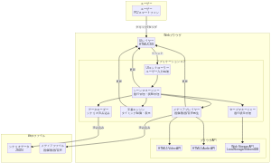
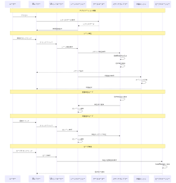
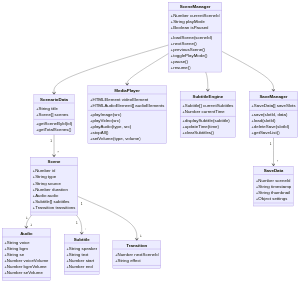

# デジタルノベルシステム技術仕様書

**バージョン**: 1.0  
**作成日**: 2025年11月6日  
**作成者**: Manus AI

---

## 目次

1. [はじめに](#1-はじめに)
2. [システム概要](#2-システム概要)
3. [機能仕様](#3-機能仕様)
4. [システムアーキテクチャ](#4-システムアーキテクチャ)
5. [データ構造](#5-データ構造)
6. [UI/UX設計](#6-uiux設計)
7. [非機能要件](#7-非機能要件)
8. [技術スタック](#8-技術スタック)
9. [実装ガイドライン](#9-実装ガイドライン)
10. [付録](#10-付録)

---

## 1. はじめに

### 1.1. 目的

本文書は、Webブラウザ上で動作する**デジタルノベルシステム**の技術的な仕様を定義することを目的としています。本システムは、画像、動画、音声、字幕を組み合わせてリッチな物語体験を提供するプラットフォームです。アドベンチャーゲームのような選択肢による分岐はなく、一本道のストーリーを視聴者に届けることに特化しています。

### 1.2. 対象読者

本文書は、以下の関係者を対象としています。

- **開発エンジニア**: システムの実装を担当する技術者
- **UIデザイナー**: ユーザーインターフェースの設計を担当するデザイナー
- **コンテンツクリエイター**: シナリオやメディアファイルを制作するクリエイター
- **プロジェクトマネージャー**: プロジェクト全体の管理を担当するマネージャー

### 1.3. スコープ

本仕様書は、デジタルノベルシステムのフロントエンド部分のみを対象としています。バックエンドサーバーは静的ファイルの配信のみを行い、動的な処理は含まれません。

---

## 2. システム概要

### 2.1. システムの定義

デジタルノベルシステムとは、画像や動画を背景として表示しながら、音声とそれに同期した字幕を組み合わせて物語を進行させるWebアプリケーションです。ユーザーは自動再生モードと手動進行モードを切り替えながら、自分のペースで物語を楽しむことができます。

### 2.2. システムアーキテクチャの概要

本システムは、クライアントサイドで完結する**Single Page Application (SPA)** として設計されています。サーバーは、HTML、CSS、JavaScript、およびメディアファイルを配信するだけで、すべてのロジックはブラウザ上で実行されます。

**主要な構成要素**:

| 構成要素 | 説明 |
|---------|------|
| **UIレイヤー** | ユーザーが直接操作する画面部分（HTML/CSS） |
| **シーンマネージャー** | シーンの進行状態を管理し、各コンポーネントを統括 |
| **メディアプレイヤー** | 画像、動画、音声の再生を担当 |
| **字幕エンジン** | 音声に同期して字幕を表示 |
| **UIコントローラー** | ユーザーの入力（クリック、タップ、キー操作）を処理 |
| **データローダー** | シナリオデータ（JSON）を読み込み |
| **セーブマネージャー** | 進行状況の保存と読み込みを管理 |



### 2.3. 動作環境

本システムは、以下の環境で動作することを前提としています。

**対応デバイス**:
- デスクトップPC（Windows、macOS、Linux）
- タブレット（iPad、Android タブレット）
- スマートフォン（iPhone、Android スマートフォン）

**対応ブラウザ**:
- Google Chrome（最新版）
- Mozilla Firefox（最新版）
- Apple Safari（最新版）
- Microsoft Edge（最新版）

**推奨環境**:
- インターネット接続速度: 5Mbps以上
- 画面解像度: 1280×720以上（PC）、375×667以上（スマートフォン）

---

## 3. 機能仕様

### 3.1. メディア表示機能

#### 3.1.1. 画像表示

背景画像やキャラクターの立ち絵などを表示します。複数の画像レイヤーを重ねて表示することで、キャラクターの表情差分や背景の演出を実現します。

**対応フォーマット**: JPEG、PNG、WebP

**主な機能**:
- 画像のフェードイン/フェードアウト
- 複数レイヤーの同時表示
- 画像のトランジション効果（スライド、ズームなど）

#### 3.1.2. 動画再生

シーンの演出として動画を再生します。動画は画面全体に表示することも、指定した領域内に表示することも可能です。

**対応フォーマット**: MP4（H.264コーデック）、WebM

**主な機能**:
- フルスクリーン再生
- ウィンドウ内再生
- 動画の自動ループ
- 動画終了時の次シーンへの自動遷移

### 3.2. 音声再生機能

音声は、**BGM**、**ボイス**、**効果音（SE）** の3種類を同時に再生できます。それぞれの音量は個別に調整可能です。

**対応フォーマット**: MP3、OGG、WAV

| 音声種別 | 説明 | 再生方式 |
|---------|------|---------|
| **BGM** | 背景音楽 | ループ再生 |
| **ボイス** | キャラクターのセリフ音声 | 単発再生 |
| **効果音（SE）** | ドアの開閉音、足音などの効果音 | 単発再生 |

**主な機能**:
- 各音声の個別音量調整
- クロスフェード（BGMの切り替え時）
- 音声の事前読み込み（プリロード）

### 3.3. 字幕表示機能

音声の内容に同期して、画面下部に字幕を表示します。字幕は話者名とテキストで構成され、音声の再生タイミングに合わせて自動的に切り替わります。

**主な機能**:
- 音声との自動同期
- 話者名の表示
- 字幕の表示/非表示切り替え
- 字幕のスタイル設定（フォント、サイズ、色、背景）

### 3.4. 再生制御機能

#### 3.4.1. 進行モード

ユーザーは、以下の2つのモードを自由に切り替えることができます。

| モード | 説明 | 次シーンへの遷移条件 |
|--------|------|---------------------|
| **自動再生モード** | 音声の再生が終了すると自動的に次のシーンに進む | 音声再生終了時、または指定時間経過時 |
| **手動進行モード** | ユーザーが画面をクリック/タップすることで次のシーンに進む | ユーザーのクリック/タップ |

#### 3.4.2. その他の制御機能

- **一時停止/再開**: 再生を一時停止し、同じ場所から再開できます。
- **スキップ**: 現在のシーンをスキップして、次のシーンに進みます。
- **バックログ**: 既読のシーン（セリフやテキスト）を一覧で確認できます。過去のシーンに戻って再生することも可能です。

### 3.5. UI/UX仕様

#### 3.5.1. レスポンシブデザイン

本システムは、PC、タブレット、スマートフォンの各画面サイズに最適化されたレイアウトを提供します。画面サイズに応じて、UIコンポーネントの配置やサイズが自動的に調整されます。

#### 3.5.2. コントロールパネル

画面下部または右下に、以下の機能を持つコントロールパネルを表示します。

- 再生/一時停止ボタン
- 進行モード切替ボタン
- 音量調整スライダー
- 設定画面への導線
- バックログ表示ボタン
- セーブ/ロードボタン

#### 3.5.3. プログレスバー

物語全体の進行状況を視覚的に表示するプログレスバーを画面上部に配置します。ユーザーは、現在どの程度物語が進んでいるかを一目で把握できます。

### 3.6. 設定機能

ユーザーは、設定画面から以下の項目を調整できます。

| 設定項目 | 説明 |
|---------|------|
| **BGM音量** | 背景音楽の音量を調整（0〜100%） |
| **ボイス音量** | キャラクターのセリフ音量を調整（0〜100%） |
| **効果音音量** | 効果音の音量を調整（0〜100%） |
| **字幕表示** | 字幕の表示/非表示を切り替え |
| **字幕サイズ** | 字幕のフォントサイズを調整（小/中/大） |
| **再生速度** | 音声の再生速度を調整（0.5倍〜2.0倍） |

### 3.7. セーブ/ロード機能

#### 3.7.1. セーブ機能

ユーザーは、現在の進行状況を複数のスロット（例: 3〜5個）に保存できます。セーブデータには、以下の情報が含まれます。

- 現在のシーンID
- セーブ日時
- サムネイル画像（現在のシーンの画像）
- 設定情報（音量など）

#### 3.7.2. ロード機能

保存したセーブデータを選択することで、その時点から物語を再開できます。

#### 3.7.3. データ保存先

セーブデータは、ブラウザの**LocalStorage**または**IndexedDB**に保存されます。これにより、サーバーとの通信なしにデータを保存・読み込みできます。

---

## 4. システムアーキテクチャ

### 4.1. アーキテクチャ図

本システムは、以下のような階層構造で設計されています。


### 4.2. 各コンポーネントの役割

#### 4.2.1. UIレイヤー

ユーザーが直接操作する画面部分です。HTML/CSSで構築され、ユーザーの入力を受け付けます。

#### 4.2.2. シーンマネージャー

システム全体の中心となるコンポーネントです。現在のシーン状態を管理し、他のコンポーネント（メディアプレイヤー、字幕エンジンなど）を統括します。

**主な責務**:
- 現在のシーンIDの管理
- 次のシーンへの遷移
- 再生モード（自動/手動）の管理
- 一時停止/再開の制御

#### 4.2.3. メディアプレイヤー

画像、動画、音声の再生を担当します。HTML5の`<video>`タグと`<audio>`タグを使用して、メディアファイルを再生します。

**主な責務**:
- 画像の表示
- 動画の再生
- BGM、ボイス、効果音の再生
- 音量の調整
- メディアファイルのプリロード

#### 4.2.4. 字幕エンジン

音声の再生タイミングに合わせて、字幕を表示します。字幕データには、開始時刻と終了時刻が含まれており、それに基づいて表示を制御します。

**主な責務**:
- 字幕の表示タイミング制御
- 話者名とテキストの表示
- 字幕のスタイル適用

#### 4.2.5. UIコントローラー

ユーザーの入力（クリック、タップ、キーボード操作）を受け取り、適切なアクションに変換します。

**主な責務**:
- クリック/タップイベントの処理
- キーボードショートカットの処理
- ボタン操作の処理

#### 4.2.6. データローダー

シナリオデータ（JSON形式）を読み込み、シーンマネージャーに渡します。

**主な責務**:
- シナリオJSONファイルの読み込み
- データのパース
- エラーハンドリング

#### 4.2.7. セーブマネージャー

進行状況の保存と読み込みを管理します。ブラウザのLocalStorageまたはIndexedDBを使用してデータを永続化します。

**主な責務**:
- セーブデータの保存
- セーブデータの読み込み
- セーブデータの削除
- セーブスロットの管理

### 4.3. シーケンス図

以下は、ユーザーがシーンを再生する際の処理フローを示したシーケンス図です。



---

## 5. データ構造

### 5.1. シナリオデータ構造

シナリオは**JSON形式**で定義します。各シーンはオブジェクトの配列として管理されます。

#### 5.1.1. 全体構造

```json
{
  "title": "作品タイトル",
  "author": "作者名",
  "version": "1.0",
  "scenes": [
    // シーンの配列
  ]
}
```

#### 5.1.2. シーンオブジェクト

各シーンは、以下のプロパティを持ちます。

```json
{
  "id": 1,
  "type": "image",
  "source": "/media/images/scene1_bg.jpg",
  "duration": 5000,
  "audio": {
    "voice": "/media/audio/voice/scene1_voice.mp3",
    "bgm": "/media/audio/bgm/theme1.mp3",
    "se": "/media/audio/se/door_open.mp3"
  },
  "subtitles": [
    {
      "speaker": "キャラクターA",
      "text": "こんにちは。ようこそ、この世界へ。",
      "start": 0,
      "end": 3000
    },
    {
      "speaker": "キャラクターB",
      "text": "ここはどこですか?",
      "start": 3500,
      "end": 5000
    }
  ],
  "transitions": {
    "nextSceneId": 2,
    "effect": "fade"
  }
}
```

#### 5.1.3. プロパティの説明

| プロパティ | 型 | 説明 |
|-----------|---|------|
| `id` | Number | シーンの一意な識別子 |
| `type` | String | メディアの種類（`"image"` または `"video"`） |
| `source` | String | メディアファイルのパス |
| `duration` | Number | 自動再生モード時の表示時間（ミリ秒） |
| `audio.voice` | String | ボイスファイルのパス（オプション） |
| `audio.bgm` | String | BGMファイルのパス（オプション） |
| `audio.se` | String | 効果音ファイルのパス（オプション） |
| `subtitles` | Array | 字幕の配列 |
| `subtitles[].speaker` | String | 話者名 |
| `subtitles[].text` | String | 字幕テキスト |
| `subtitles[].start` | Number | 字幕表示開始時刻（ミリ秒） |
| `subtitles[].end` | Number | 字幕表示終了時刻（ミリ秒） |
| `transitions.nextSceneId` | Number | 次のシーンのID |
| `transitions.effect` | String | トランジション効果（`"fade"`, `"slide"`, `"none"`など） |

### 5.2. セーブデータ構造

セーブデータもJSON形式で管理します。

```json
{
  "saveSlot1": {
    "sceneId": 10,
    "timestamp": "2025-11-06T12:00:00Z",
    "thumbnail": "/media/thumbnails/scene10.jpg",
    "settings": {
      "bgmVolume": 80,
      "voiceVolume": 100,
      "seVolume": 70,
      "subtitlesEnabled": true,
      "subtitleSize": "medium"
    }
  },
  "saveSlot2": null,
  "saveSlot3": null
}
```

### 5.3. クラス図

以下は、システムの主要なクラスとその関係を示したクラス図です。



---

## 6. UI/UX設計

### 6.1. 画面レイアウト

#### 6.1.1. PC版レイアウト

```
+--------------------------------------------------+
|  [プログレスバー]                                  |
+--------------------------------------------------+
|                                                  |
|                                                  |
|              メディア表示エリア                    |
|            (画像/動画が表示される)                 |
|                                                  |
|                                                  |
+--------------------------------------------------+
|  [話者名]                                         |
|  字幕テキストがここに表示されます。                 |
+--------------------------------------------------+
|  [再生/停止] [モード切替] [音量] [設定] [セーブ]   |
+--------------------------------------------------+
```

#### 6.1.2. スマートフォン版レイアウト

```
+-------------------------+
|  [プログレスバー]        |
+-------------------------+
|                         |
|    メディア表示エリア     |
|                         |
+-------------------------+
|  [話者名]               |
|  字幕テキスト            |
+-------------------------+
|  [▶] [⚙] [💾]         |
+-------------------------+
```

### 6.2. カラースキーム

システムのデフォルトカラースキームは、以下のように設定します。

| 要素 | カラーコード | 説明 |
|------|------------|------|
| 背景色 | `#000000` | 黒（メディアを引き立てるため） |
| 字幕背景 | `rgba(0, 0, 0, 0.7)` | 半透明の黒 |
| 字幕テキスト | `#FFFFFF` | 白 |
| アクセントカラー | `#FF6B6B` | 赤系（ボタンやハイライト） |
| コントロールパネル背景 | `rgba(30, 30, 30, 0.9)` | 半透明のダークグレー |

### 6.3. フォント

- **字幕**: Noto Sans JP（日本語）、Roboto（英語）
- **UI要素**: システムフォント（-apple-system, BlinkMacSystemFont, "Segoe UI", Roboto, sans-serif）

### 6.4. アニメーション

ユーザー体験を向上させるため、以下のアニメーションを実装します。

- シーン遷移時のフェードイン/フェードアウト（300ms）
- ボタンホバー時のスケールアップ（150ms）
- 字幕表示時のフェードイン（200ms）

---

## 7. 非機能要件

### 7.1. パフォーマンス

本システムは、スムーズな再生体験を提供するため、以下のパフォーマンス目標を設定します。

| 指標 | 目標値 |
|------|--------|
| フレームレート | 60fps以上 |
| 初回ロード時間 | 3秒以内（3G回線） |
| シーン遷移時間 | 500ms以内 |
| メモリ使用量 | 200MB以内（モバイル） |

**最適化手法**:
- 次のシーンで使用するメディアファイルの事前読み込み（プリロード）
- 画像の遅延読み込み（Lazy Loading）
- 動画の適切な圧縮とビットレート設定
- 不要なDOMの削除とメモリ解放

### 7.2. アクセシビリティ

すべてのユーザーが快適に利用できるよう、以下のアクセシビリティ対応を実施します。

- **キーボード操作**: 主要な操作（再生/停止、次へ進む、設定を開くなど）はキーボードで実行可能
- **スクリーンリーダー対応**: ARIA属性を適切に設定し、視覚障害者も利用可能に
- **カラーコントラスト**: WCAG 2.1のAA基準を満たすコントラスト比を確保
- **字幕**: 聴覚障害者のために、すべての音声に字幕を提供

### 7.3. ブラウザ互換性

「2.3. 動作環境」で定義されたすべてのブラウザで、同等の体験を提供します。ブラウザ間の差異は、Polyfillやベンダープレフィックスを使用して吸収します。

### 7.4. セキュリティ

- **XSS対策**: ユーザー入力やシナリオデータの適切なサニタイズ
- **CORS設定**: メディアファイルの読み込みに適切なCORS設定を実施
- **HTTPS**: 本番環境ではHTTPSを使用し、通信を暗号化

### 7.5. 拡張性

将来的な機能追加に対応できるよう、以下の拡張性を考慮します。

- モジュール化されたコード設計
- プラグインシステムの導入（オプション）
- シナリオデータのバージョン管理

---

## 8. 技術スタック

### 8.1. フロントエンド

| カテゴリ | 技術 | 説明 |
|---------|------|------|
| **言語** | TypeScript | 型安全性を確保し、大規模開発に対応 |
| **フレームワーク** | React / Vue.js / Vanilla JS | プロジェクトの規模に応じて選択 |
| **状態管理** | Redux / Vuex / Context API | グローバルな状態管理 |
| **スタイリング** | CSS3 / Tailwind CSS / Styled Components | レスポンシブデザインの実装 |
| **音声管理** | Howler.js | 複数の音声を同時に管理 |
| **アニメーション** | GSAP / CSS Animations | スムーズなトランジション効果 |

### 8.2. ビルドツール

| ツール | 用途 |
|--------|------|
| **Vite** | 高速な開発サーバーとビルド |
| **Webpack** | 複雑なビルド設定が必要な場合 |
| **ESLint** | コード品質の維持 |
| **Prettier** | コードフォーマットの統一 |

### 8.3. テスト

| ツール | 用途 |
|--------|------|
| **Jest** | ユニットテスト |
| **React Testing Library / Vue Testing Library** | コンポーネントテスト |
| **Cypress** | E2Eテスト |

### 8.4. デプロイ

| サービス | 用途 |
|---------|------|
| **Netlify / Vercel** | 静的サイトのホスティング |
| **AWS S3 + CloudFront** | 大規模配信 |
| **GitHub Pages** | 小規模プロジェクト向け |

---

## 9. 実装ガイドライン

### 9.1. ディレクトリ構成

以下は、推奨されるプロジェクトのディレクトリ構成です。

```
digital-novel-system/
├── public/
│   ├── index.html
│   └── favicon.ico
├── src/
│   ├── components/         # UIコンポーネント
│   │   ├── MediaPlayer.tsx
│   │   ├── SubtitleDisplay.tsx
│   │   ├── ControlPanel.tsx
│   │   └── ...
│   ├── managers/           # 各種マネージャー
│   │   ├── SceneManager.ts
│   │   ├── SaveManager.ts
│   │   └── ...
│   ├── types/              # TypeScriptの型定義
│   │   ├── Scene.ts
│   │   ├── SaveData.ts
│   │   └── ...
│   ├── utils/              # ユーティリティ関数
│   │   ├── preloader.ts
│   │   ├── storage.ts
│   │   └── ...
│   ├── styles/             # スタイルシート
│   │   ├── global.css
│   │   └── ...
│   ├── App.tsx             # メインアプリケーション
│   └── main.tsx            # エントリーポイント
├── data/
│   └── scenario.json       # シナリオデータ
├── media/
│   ├── images/             # 画像ファイル
│   ├── videos/             # 動画ファイル
│   └── audio/              # 音声ファイル
│       ├── bgm/
│       ├── voice/
│       └── se/
├── package.json
├── tsconfig.json
└── vite.config.ts
```

### 9.2. コーディング規約

- **命名規則**: camelCaseを使用（クラス名はPascalCase）
- **コメント**: 複雑なロジックには必ずコメントを記載
- **型定義**: すべての関数に型注釈を付ける
- **コンポーネント**: 単一責任の原則に従い、小さく保つ

### 9.3. パフォーマンス最適化

- **メディアファイルの圧縮**: 画像はWebP形式、動画はH.264コーデックを使用
- **コード分割**: 動的インポートを使用して、初回ロード時間を短縮
- **キャッシュ戦略**: Service Workerを使用して、メディアファイルをキャッシュ

### 9.4. テスト戦略

- **ユニットテスト**: 各マネージャークラスの主要メソッドをテスト
- **統合テスト**: シーンマネージャーとメディアプレイヤーの連携をテスト
- **E2Eテスト**: ユーザーの主要なフロー（シーン再生、セーブ/ロード）をテスト

---

## 10. 付録

### 10.1. 用語集

| 用語 | 説明 |
|------|------|
| **シーン** | 物語の最小単位。1つの画像/動画と音声、字幕のセット |
| **自動再生モード** | 音声の再生が終了すると自動的に次のシーンに進むモード |
| **手動進行モード** | ユーザーのクリック/タップで次のシーンに進むモード |
| **バックログ** | 既読のシーンを一覧で確認できる機能 |
| **プリロード** | 次のシーンで使用するメディアファイルを事前に読み込むこと |

### 10.2. 参考資料

本仕様書の作成にあたり、以下の技術やコンセプトを参考にしました。

- **HTML5 Video API**: 動画再生の標準仕様
- **Web Audio API**: 高度な音声制御
- **WebVTT**: 字幕フォーマットの標準仕様
- **Howler.js**: 音声管理ライブラリ
- **GSAP**: アニメーションライブラリ

### 10.3. 今後の拡張案

将来的に以下の機能を追加することを検討しています。

- **多言語対応**: 字幕とUIの多言語化
- **選択肢分岐**: アドベンチャーゲーム的な選択肢システム
- **実績システム**: 特定の条件を満たすと解除される実績
- **ギャラリーモード**: 既読のシーンやイラストを閲覧できる機能
- **音声認識**: ユーザーの声で操作できる機能
- **VR対応**: VRヘッドセットでの没入体験

---

## 変更履歴

| バージョン | 日付 | 変更内容 |
|-----------|------|---------|
| 1.0 | 2025-11-06 | 初版作成 |

---

**本文書に関するお問い合わせ**: 開発チームまでご連絡ください。
